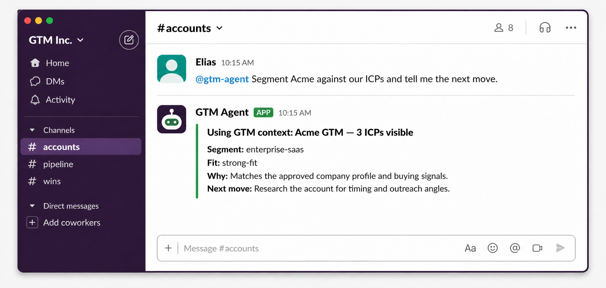

<h3 align="center">Run your full GTM motion from one Slack agent</h3>

GTM Agent lets your team define the market, qualify accounts and leads, and research the next move when one-off prompts keep losing the rules, by bringing nine open source GTM skills into Slack and connecting them to one Git-backed GTM context.

&nbsp;&nbsp;

✓&nbsp;100%&nbsp;free&nbsp;and&nbsp;open&nbsp;source &nbsp; ✓&nbsp;Nine&nbsp;GTM&nbsp;skills,&nbsp;one&nbsp;Slack&nbsp;agent &nbsp; ✓&nbsp;Built&nbsp;for&nbsp;the&nbsp;full&nbsp;GTM&nbsp;motion

<small>⭐ Used by top GTM teams</small>

 

## Make Slack the front door to your GTM operating system

A teammate asks for the outcome in a channel or DM. GTM Agent selects the focused workflow, reads the connected organization context when the job requires it, and returns the reasoning where the rest of the team can review it.

## Choose between rebuilding prompts, switching between tools, wiring a generic chatbot — or deploying one purpose-built GTM agent in Slack

| | **GTM Agent** | Repeated prompts | Standalone templates | Generic AI chat |
|---|:---:|:---:|:---:|:---:|
| **Ships as a ready-to-deploy Eve Slack agent** | ✅ | ❌ | ❌ | ❌ |
| **Includes the exact nine GTM Skills workflows** | ✅ | ❌ | ❌ | ❌ |
| **Pins one context repository at deployment** | ✅ | ❌ | ❌ | ❌ |
| **Keeps connector tokens out of sandbox commands** | ✅ | ❌ | ❌ | ❌ |
| **Uses native approval for context writes** | ✅ | ❌ | ❌ | ❌ |
| **Commits an approved change atomically on main** | ✅ | ❌ | ❌ | ❌ |
| **Stops a write when the repository HEAD changes** | ✅ | ❌ | ❌ | ❌ |
| **Adds no database, web UI, or alternate memory** | ✅ | ❌ | ❌ | ❌ |

GTM Agent arrives as a deliberately narrow Eve template: one Slack interface, one exact workflow inventory, one deployment-fixed context target, and one approval-gated path for durable changes.

## Ask the question. See the GTM basis. Take the next action.

### 📈 Run the GTM work where the request appears

Ask for ICP, persona, segmentation, scoring, or research work in Slack without sending the team into a separate GTM application.

### ⚡ Use one agent for nine focused jobs

The agent routes each request to a named workflow instead of relying on one giant prompt to improvise the method.

### 💬 Keep durable changes reviewable

When connected context needs an update, the agent shows the complete proposal and applies it only through native approval and one atomic commit.

## Deploy the agent and ask the first GTM question in three steps

<table>
<tr>
<td align="center" valign="top" width="33%"><h3>1️⃣</h3><b>Deploy GTM Agent</b> Create the Vercel project from this Eve template and configure the required model access.</td>
<td align="center" valign="top" width="33%"><h3>2️⃣</h3><b>Connect Slack</b> Authorize the generated Slack app and verify the standard Eve health endpoint.</td>
<td align="center" valign="top" width="33%"><h3>3️⃣</h3><b>Connect your GTM context</b> Point the deployment at one repository when the team wants shared organization, ICP, persona, and people context.</td>
</tr>
</table>

## Choose how to get started

<table>
<tr>
<td align="center" valign="top" width="50%"><h3>Self-serve</h3>For GTM builders and teams using Slack <h2>Free</h2>
&nbsp;&nbsp;&nbsp;✓&nbsp; One open-source Eve Slack agent &nbsp;&nbsp;&nbsp;✓&nbsp; Nine focused GTM skills &nbsp;&nbsp;&nbsp;✓&nbsp; Slack-only deployment &nbsp;&nbsp;&nbsp;✓&nbsp; One Git-backed GTM context repository &nbsp;&nbsp;&nbsp;✓&nbsp; Approval-gated atomic context updates &nbsp;&nbsp;&nbsp;✓&nbsp; Evidence-backed account and lead research
</td>
<td align="center" valign="top" width="50%"><h3>Done-with-you</h3>Hands-on setup and rollout for your GTM team <h2>Let's talk</h2>
&nbsp;&nbsp;&nbsp;✓&nbsp; Everything in self-serve &nbsp;&nbsp;&nbsp;✓&nbsp; GTM Agent deployment &nbsp;&nbsp;&nbsp;✓&nbsp; Slack and GitHub connector setup &nbsp;&nbsp;&nbsp;✓&nbsp; GTM context repository configuration &nbsp;&nbsp;&nbsp;✓&nbsp; ICP and persona workflow design &nbsp;&nbsp;&nbsp;✓&nbsp; Team rollout, training, and best practices &nbsp;&nbsp;&nbsp;✓&nbsp; Dedicated Slack channel support
</td>
</tr>
<tr>
<td align="center"></td>
<td align="center"></td>
</tr>
</table>

## Get your questions answered

### What does GTM Agent deploy?

One deliberately small Eve agent with Slack as its only channel, the exact approved GTM workflow inventory, and an optional connection to one fixed GTM context repository.

### Can I use it without a context repository?

Yes. Slack-only mode can load the workflows, explain their prerequisites, and run compatible response-only work. Jobs that require saved ICPs, personas, or organization context stop and explain what is missing.

### What changes when I connect GitHub?

The agent can read the organization context from the configured repository and propose in-contract context changes through its sole approval-gated write tool.

### How does GTM Agent write context safely?

It validates the complete path manifest and expected HEAD, asks for native approval, compares remote `main`, and creates one atomic commit or no write.

### Can the agent browse the web or update our CRM?

Research workflows can inspect safe public sources when browsing is available. Research is response-only and does not write to a CRM, context files, Git history, or another external system.

### What does it cost?

GTM Agent is free, open source, and [MIT licensed](LICENSE). The bundled GTM Skills carry their separate [MIT license](LICENSES/gtmskills-MIT.txt). Vercel, Slack, GitHub, model, and research-provider usage may be subject to their own plans and charges.

## Put the next GTM decision in Slack

Your team asks in the conversation. GTM Agent brings the workflow, connected context, and next action into the same thread.

&nbsp;&nbsp;

✓&nbsp;100%&nbsp;free&nbsp;and&nbsp;open&nbsp;source &nbsp; ✓&nbsp;Nine&nbsp;GTM&nbsp;skills,&nbsp;one&nbsp;Slack&nbsp;agent &nbsp; ✓&nbsp;Built&nbsp;for&nbsp;the&nbsp;full&nbsp;GTM&nbsp;motion

<small>⭐ Used by top GTM teams</small>

